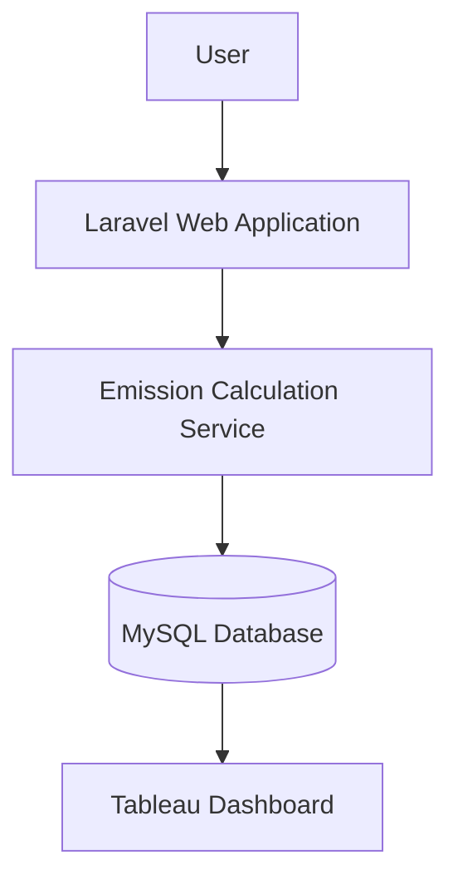

# JejakKarbonmu

> **Carbon Footprint Management & Greenhouse Gas (GHG) Accounting
> System**

[](https://laravel.com)
[](https://php.net)
[](https://www.mysql.com)
[](https://www.tableau.com)

------------------------------------------------------------------------

## Overview

**JejakKarbonmu** is a web-based Greenhouse Gas (GHG) accounting system
developed as part of the **KOICA -- Digital Carbon 
Management Capstone Project**.

The system records emission-producing activities, calculates carbon
emissions, stores historical records, and integrates directly with
Tableau for sustainability analytics and reporting.

------------------------------------------------------------------------

## Background

Organizations increasingly require digital tools capable of recording
emission activities, applying standardized carbon accounting
methodologies, maintaining historical records, and supporting
data-driven sustainability decisions.

JejakKarbonmu combines carbon accounting, relational databases, and
business intelligence into a single workflow.

------------------------------------------------------------------------

## Key Features

-   Carbon footprint calculation for Scope 1, Scope 2, and Scope 3.
-   Configurable emission factor management.
-   Historical emission records.
-   Category-based emission tracking.
-   Direct Tableau integration.
-   Relational database with transactional integrity.

------------------------------------------------------------------------

## Emission Factor Standards

The calculation engine follows internationally recognized carbon
accounting references.

The current implementation primarily adopts the **GHG Protocol Corporate
Accounting and Reporting Standard** for emission classification (Scope
1, Scope 2, and Scope 3).

Emission factors are referenced from recognized sources, including:

-   **GHG Protocol** -- Carbon accounting framework and emission
    classification.
-   **IPCC Guidelines for National Greenhouse Gas Inventories** --
    Emission calculation methodology and reference factors.
-   **Indonesia National Emission Factors (where applicable)** --
    Country-specific emission factors such as electricity grid
    emissions.

The system stores emission factors in the database, allowing future
updates or additional standards without modifying the calculation
engine.

------------------------------------------------------------------------

## System Architecture



Laravel handles data collection, validation, and emission calculations,
while Tableau connects directly to MySQL for visualization and business
analytics.

------------------------------------------------------------------------

## Calculation Workflow

``` text
User Activity
      ↓
Select Emission Standard
      ↓
Retrieve Emission Factor
      ↓
Calculate Emissions
      ↓
Store Activity Details
      ↓
Aggregate Scope Totals
      ↓
Store Historical Records
      ↓
Tableau Dashboard
```

------------------------------------------------------------------------

## Technology Stack

  Component       Technology
  --------------- ---------------------
  Backend         Laravel 12
  Language        PHP 8.2
  Frontend        Blade & Bootstrap 5
  Database        MySQL
  Visualization   Tableau
  Architecture    MVC

------------------------------------------------------------------------

## Database Overview

  ----------------------------------------------------------------------------
  Table                       Description
  --------------------------- ------------------------------------------------
  `emission_standards`        Stores supported emission accounting standards.

  `emission_factors`          Stores emission factors used during
                              calculations.

  `emission_records`          Stores emission summaries for each reporting
                              period.

  `emission_record_details`   Stores activity-level calculation details.
  ----------------------------------------------------------------------------

### Entity Relationship

``` text
Emission Standards
      │
      ├──────────────┐
      ▼              ▼
Emission Factors  Emission Records
                         │
                         ▼
             Emission Record Details
```

------------------------------------------------------------------------

## Dataset

The project uses a hybrid dataset.

-   **Original Data**: Annual emission totals (FY20--FY24) derived from
    Microsoft's Environmental Sustainability Report.
-   **Synthetic Data**: Monthly records, activity values, and
    category-level emission data generated through documented synthetic
    data generation methods because detailed operational records are not
    publicly available.

All assumptions used during synthetic data generation are documented
separately to maintain transparency.

------------------------------------------------------------------------

## Project Structure

``` text
app/
 ├── Http/
 ├── Models/
 ├── Services/
database/
 ├── migrations/
 ├── seeders/
resources/
 ├── views/
routes/
public/
```

------------------------------------------------------------------------

## AI-Assisted Development

This project was developed using an **AI-assisted software development
workflow**.

AI tools were used to accelerate implementation, debugging,
documentation, and iterative development. The overall architecture,
database design, business rules, calculation logic, and engineering
decisions remained under developer supervision throughout the project.

------------------------------------------------------------------------

## Installation

### Requirements

-   PHP 8.2+
-   Composer
-   Node.js & npm
-   MySQL

### Setup

``` bash
git clone https://github.com/BagusAbdulWahhab/koica-silla-university.git
cd koica-silla-university/CarbonManagement

composer install
npm install

cp .env.example .env

php artisan key:generate
php artisan migrate

php artisan db:seed --class=EmissionFactorSeeder
php artisan db:seed --class=EmissionRecordSeeder

npm run build
php artisan serve
```

------------------------------------------------------------------------

## Tableau Integration

Connect Tableau directly to the project's MySQL database to build
dashboards such as:

-   Total Emission KPI
-   Monthly Emission Trend
-   Scope Comparison
-   Category Contribution
-   Top Emission Sources
-   Historical Emission Analysis

------------------------------------------------------------------------

## Future Improvements

-   Authentication and authorization
-   Multi-organization support
-   Carbon reduction target monitoring
-   PDF & Excel export
-   REST API
-   Additional emission standards

------------------------------------------------------------------------

## References

-   GHG Protocol Corporate Accounting and Reporting Standard
-   IPCC Guidelines for National Greenhouse Gas Inventories
-   Microsoft Environmental Sustainability Report (FY20--FY24)
-   Tableau Documentation

------------------------------------------------------------------------

## License

Developed for academic purposes as part of the **KOICA -- Silla
University Digital Carbon Management Program**.
