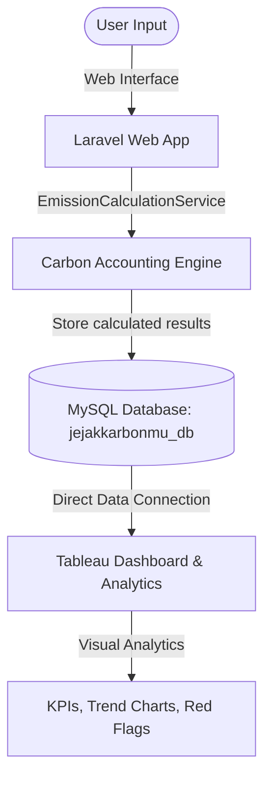

# JejakKarbonmu - Carbon Footprint Management System

[](https://laravel.com)
[](https://php.net)
[](https://www.mysql.com)
[](https://www.tableau.com)

**JejakKarbonmu** is a Greenhouse Gas (GHG) emission accounting and calculation web application built with **Laravel 12**, **Bootstrap 5**, and **MySQL**. 

This system is specifically engineered to serve as a high-fidelity carbon calculation and historical data collection engine. It is designed to act as the primary data source for **Tableau**, enabling organizations to build interactive visualization dashboards, analyze emission trends, trigger red-flag anomaly alerts, and gain business insights.

---

## 📊 System Architecture & Data Flow

The application isolates the user inputs and calculation logic from the visualization layer. Rather than rendering complex dashboards inside the PHP application, it acts as a transactional data warehouse. Tableau connects directly to the MySQL database to drive reports.



---

## 🛠️ Technology Stack

- **Backend Framework:** Laravel 12 (Model-View-Controller)
- **Programming Language:** PHP 8.2+
- **Frontend Framework:** Blade Templates & Bootstrap 5 (Responsive Layout)
- **Database:** MySQL 8.x
- **Data Visualization Layer:** Tableau (Direct MySQL Connection)

---

## 🌟 Key Features

1. **Multi-Standard Emission Factor System:**
   - Supports switching between multiple standards (e.g., **GHG Protocol**, **IPCC**, and **Indonesia National Standard**).
   - The selected standard dynamically applies the appropriate emission factors loaded from the database.

2. **Categorized Carbon Accounting (GHG Protocol):**
   - **Scope 1 (Direct Emissions):** Tracks Diesel, Petrol, LPG, Natural Gas, and Refrigerant.
   - **Scope 2 (Indirect Emissions):** Tracks Purchased Electricity and Purchased Steam.
   - **Scope 3 (Indirect Value Chain):** Features a flexible selector allowing users to dynamically choose which categories to input (e.g., Business Travel, Commuting, Waste, Water, etc.).

3. **Tableau-Ready Seeding Engine:**
   - Includes a custom database seeder (`EmissionRecordSeeder`) that populates 12 months of realistic historical data (Jan 2024 - Dec 2024).
   - Designed with realistic monthly fluctuations, a **production spike in July 2024** (to test red-flag analytics), and a **high Scope 2 period in October 2024** (Scope 2 > 85% of total) to validate dashboards.

4. **Lifecycle Management:**
   - Full historical records view with detailed scope breakdowns.
   - Secure record removal with automated database-level cascade deletions.

---

## 💾 Database Schema

The database model is optimized for transactional logging and relational integrity:

### 1. `emission_standards`
Stores the supported carbon standards.
- `id` (PK)
- `name` (e.g., "GHG Protocol", "IPCC")
- `description`, `reference_source`, `publication_year`

### 2. `emission_factors`
Stores emission factors corresponding to standards.
- `id` (PK)
- `emission_standard_id` (FK)
- `scope` (1, 2, or 3)
- `category_name` (e.g., "Diesel", "Purchased Electricity")
- `unit` (e.g., "Liters", "kWh")
- `factor` (Decimal value of kgCO₂e per unit)
- `reference_source`

### 3. `emission_records`
Stores the summary of calculations for reporting periods.
- `id` (PK)
- `reporting_period` (e.g., "January 2024")
- `emission_standard_id` (FK)
- `scope1_total`, `scope2_total`, `scope3_total` (in kgCO₂e)
- `total_emission` (in kgCO₂e)

### 4. `emission_record_details`
Stores granular category-level inputs and calculations.
- `id` (PK)
- `emission_record_id` (FK, cascades on delete)
- `scope`, `category_name`, `activity_value`, `unit`, `emission_factor`, `emission_result`

---

## 💡 Development Methodology (AI-Assisted Collaboration)

This codebase was engineered utilizing modern **AI-assisted rapid prototyping methods (often referred to as "Vibe Coding")**. Under the direct architectural steering of the main developer, advanced AI orchestration was utilized to accelerate the coding process.

This methodology demonstrates the potential of developer-AI synergy:
- **Velocity:** Core features, seeders, and services were written, tested, and updated iteratively in a fraction of typical development cycles.
- **Architectural Quality:** Maintained strict MVC principles, isolated business logic in a dedicated service layer (`EmissionCalculationService`), and implemented clean database relationships with full transactional safety.
- **Data Engineering:** Enabled automated generation of realistic, noise-injected historical data to prepare the system for immediate Tableau deployment.

---

## 🚀 Installation & Setup

Follow these steps to set up the project locally:

### Prerequisites
- PHP >= 8.2
- Composer
- Node.js & NPM
- MySQL Server

### 1. Clone the Project
```bash
git clone https://github.com/BagusAbdulWahhab/koica-silla-university.git
cd koica-silla-university/CarbonManagement
```
*(Or navigate to your local workspace if already cloned.)*

### 2. Install Dependencies
```bash
composer install
npm install
```

### 3. Environment Configuration
Copy the environment template and set up your database connection:
```bash
cp .env.example .env
```
Open `.env` and configure your database parameters:
```env
DB_CONNECTION=mysql
DB_HOST=127.0.0.1
DB_PORT=3306
DB_DATABASE=jejakkarbonmu_db
DB_USERNAME=root
DB_PASSWORD=
```

### 4. Key Generation & Database Migration
Run the artisan commands to generate your app key and set up your database:
```bash
php artisan key:generate
php artisan migrate
```

### 5. Seed Database Factors & Demo Data
Seed the tables with required emission factors and 12-month historical data for Tableau:
```bash
# Seed standards and factors
php artisan db:seed --class=EmissionFactorSeeder

# Seed Tableau-ready historical demo records
php artisan db:seed --class=EmissionRecordSeeder
```

### 6. Build Assets and Start Servers
Compile assets and run the local development server:
```bash
# Build frontend assets
npm run build

# Start the Laravel server
php artisan serve
```
Access the application at `http://127.0.0.1:8000`.

---

## 📈 Tableau Dashboard Integration

Tableau should be connected directly to your MySQL instance running the `jejakkarbonmu_db` database. 

### Suggested Visualizations
- **KPI Summary Cards:** Total Carbon Footprint (tCO₂e), YTD Emissions, Average monthly emissions.
- **Monthly Trend Chart:** Line graph showing `total_emission` across the `reporting_period` fields. Use this to highlight the **July 2024 anomaly spike**.
- **Scope Allocation:** Donut or Pie chart showing breakdown percentage of Scope 1, Scope 2, and Scope 3.
- **Category Pareto Chart:** Column chart sorting `category_name` by `emission_result` to highlight top polluters.
