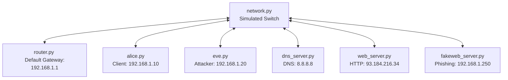

# KOICA - Cyber Network Simulation Lab

A Python-based simulation of a Local Area Network (LAN) that demonstrates layer 2 networking concepts (MAC addressing, switching, ARP resolution), Layer 7 protocols (DNS, TLS, HTTP), and common cybersecurity vulnerabilities, specifically **Man-in-the-Middle (MitM) via ARP Cache Poisoning** and **DNS Poisoning**.

## Table of Contents
1. [Overview & Architecture](#overview--architecture)
2. [Network Components](#network-components)
3. [Attack Vectors & Flow](#attack-vectors--flow)
4. [Installation & Setup](#installation--setup)
5. [Running the Simulation](#running-the-simulation)
   - [Scenario A: Normal Operations](#scenario-a-normal-operations)
   - [Scenario B: Active MitM & DNS Poisoning Attack](#scenario-b-active-mitm--dns-poisoning-attack)
6. [Defense Mechanisms Covered](#defense-mechanisms-covered)

---

## Overview & Architecture

This laboratory project simulates a physical network over TCP sockets. A central switch/hub (`network.py`) brokers all communication at the MAC address level, while clients and servers run as independent processes communicating via simulated Ethernet frames (JSON packets wrapped with MAC headers).

### Network Topology



---

## Network Components

Each component runs in its own process and binds to the simulated LAN:

1. **`network.py` (The Hub/Switch)**: The core network broker. It listens on `127.0.0.1:9000` and handles registration of host MAC addresses, broadcasting `ARP_REQUEST` packets, and routing `UNICAST` payloads.
2. **`router.py` (Default Gateway)**: Configured with IP `192.168.1.1` and MAC `RR`. It intercepts outbound traffic, routes DNS queries to the external DNS Server, and maintains an ARP cache to forward incoming replies back to local hosts.
3. **`dns_server.py` (DNS Resolver)**: Configured with IP `8.8.8.8` and MAC `DD`. Resolves domain queries for registered sites like `bank.com` to `93.184.216.34`.
4. **`web_server.py` (Legitimate Web Server)**: Configured with IP `93.184.216.34` and MAC `WS`. Serves SSL/TLS traffic with certificates signed by a trusted Authority (`"Trusted CA"`).
5. **`fakeweb_server.py` (Malicious Web Server)**: Configured with IP `192.168.1.250` and MAC `WS`. Acts as a decoy phishing site, serving certificates signed by an untrusted authority (`"FAKE"`).
6. **`alice.py` (Client/Victim)**: Configured with IP `192.168.1.10` and MAC `AA`. An interactive CLI representing a user requesting access to web domains. It performs TLS validation of server certificates.
7. **`eve.py` (Attacker/MitM)**: Configured with IP `192.168.1.20` and MAC `EE`. A security auditing tool/attacker CLI that intercepts, forwards, modifies packets, performs ARP Spoofing (poisoning the Router and Alice), and conducts DNS Poisoning.

---

## Attack Vectors & Flow

### 1. ARP Cache Poisoning (Man-in-the-Middle)
Because the network relies on ARP mapping without cryptographic verification:
- Eve sends unsolicited spoofed `ARP_REPLY` packets to Alice saying: *"The router (192.168.1.1) is at MAC EE"*
- Eve sends unsolicited spoofed `ARP_REPLY` packets to the Router saying: *"Alice (192.168.1.10) is at MAC EE"*
- This diverts all traffic between Alice and the Router through Eve's machine (`MAC EE`).

### 2. DNS Poisoning
Once Eve intercepts traffic:
- If `DNS Poisoning` is enabled, when Alice sends a DNS query (e.g. for `bank.com`), Eve intercepts it and returns a fake reply indicating the site is at `192.168.1.250` (the Phishing server) instead of forwarding it to the real server.

---

## Installation & Setup

1. **Clone the repository**:
   ```bash
   git clone https://github.com/BagusAbdulWahhab/koica-silla-university.git
   cd koica-silla-university
   ```
2. **Requirements**:
   - Python 3.x (Standard library only; no external dependencies required).

---

## Running the Simulation

For the full simulation, open **seven separate terminal windows** (or tabs) and launch the components in the following order:

1. **Start the Network Hub (Switch)**:
   ```bash
   python network.py
   ```
2. **Start the Router**:
   ```bash
   python router.py
   ```
3. **Start the DNS Server**:
   ```bash
   python dns_server.py
   ```
4. **Start the Legitimate Web Server**:
   ```bash
   python web_server.py
   ```
5. **Start the Phishing Web Server**:
   ```bash
   python fakeweb_server.py
   ```
6. **Start the Client (Alice)**:
   ```bash
   python alice.py
   ```
7. **Start the Attacker (Eve)**:
   ```bash
   python eve.py
   ```

---

### Scenario A: Normal Operations

1. In Alice's terminal, select Option `1` (Open Website) and type `bank.com`.
2. Observe the flow:
   - **ARP Cache Miss**: Alice requests the MAC address of the gateway (`192.168.1.1`).
   - **DNS Query**: Alice sends a query to the router. The router forwards this to the DNS server (`8.8.8.8`), which returns `93.184.216.34`.
   - **TLS Handshake**: Alice establishes connection to the Web Server, which responds with a certificate issued by `Trusted CA`.
   - **Result**: Alice prints `HTTPS Connection Established`.

---

### Scenario B: Active MitM & DNS Poisoning Attack

1. In Eve's terminal:
   - Select Option `1` (ARP Discovery) to scan the network. Wait a few seconds for discovery requests to go out.
   - Select Option `2` to view known hosts. You should see Alice (`192.168.1.10`) and the Router (`192.168.1.1`).
   - Select Option `3` (Select Victim) and enter Alice's IP (`192.168.1.10`).
   - Select Option `4` (Select Gateway) and enter the Router's IP (`192.168.1.1`).
   - Select Option `5` (Start ARP Spoof) to begin poisoning their caches.
   - Select Option `8` (Toggle DNS Poisoning) to enable DNS Spoofing.
2. In Alice's terminal:
   - Select Option `2` (Show ARP Cache) and observe that the MAC address for `192.168.1.1` has changed to `EE` (Eve's MAC).
   - Select Option `1` (Open Website) and request `bank.com`.
3. In Eve's terminal, observe that the DNS Query packet was intercepted. Eve responds with a DNS Reply indicating `bank.com` is at `192.168.1.250`.
4. In Alice's terminal:
   - Alice receives the spoofed IP and starts a connection.
   - The Phishing Server returns a certificate issued by `FAKE`.
   - Alice's console prints **`Certificate Mismatch`** (SSL/TLS warning).

---

## Defense Mechanisms Covered

- **SSL/TLS Certificates**: The simulation illustrates that even if an attacker successfully controls Layer 2 (ARP spoofing) and Layer 7 (DNS spoofing), **TLS/HTTPS** prevents secret data exposure by validating the certificate authority (CA) and common names. Alice detects the mismatch and refuses to establish a secure connection with the fake server.
